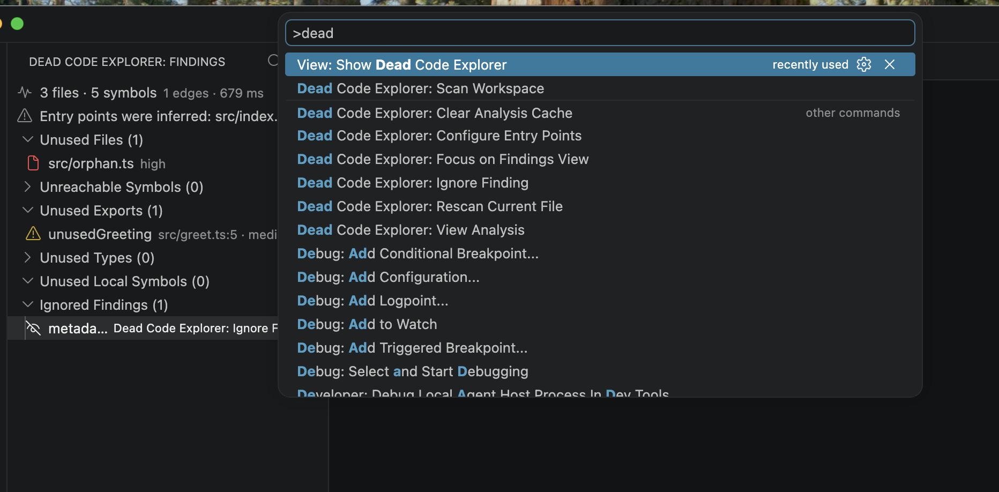
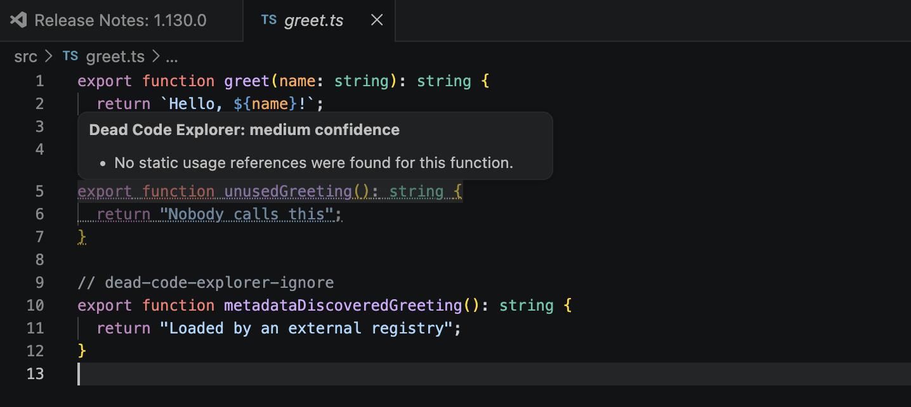

# Dead Code Explorer

Dead Code Explorer is an evidence-based VS Code extension for identifying
potentially unreachable files, functions, classes, types, and exports before
runtime. It combines compiler-aware project analysis with confidence scoring
and editor navigation so developers can investigate findings without leaving
their workspace.

Analysis runs locally through the TypeScript compiler and `ts-morph`. Source
code is never uploaded, and the extension does not require a backend, network
service, or AI model.

## Preview

### Explore workspace findings

Review scan metrics, inferred entry points, unreachable files, unused exports,
and intentionally ignored findings from a dedicated Activity Bar view.



### Inspect the evidence

Open a finding in its source file and review the confidence level and static
evidence directly in the editor.



## Run the extension

Requirements:

- Node.js 20 or newer
- VS Code 1.95 or newer

Install dependencies and build the extension:

```sh
npm ci
npm run build
```

Open the repository in VS Code and press `F5` to launch an Extension
Development Host. In the new window, open a single-root project with a
source-bearing `tsconfig.json` at its workspace root, then run:

`Dead Code Explorer: Scan Workspace`

To package and install the extension locally:

```sh
npx @vscode/vsce package --out dead-code-explorer-0.1.0.vsix
code --install-extension dead-code-explorer-0.1.0.vsix
```

## Using the findings

Each scan reports the number of files, indexed symbols, dependency-graph edges,
and total scan duration. Findings are organized into:

- Unused Files
- Unreachable Symbols
- Unused Exports
- Unused Types
- Unused Local Symbols
- Ignored Findings

Selecting a finding opens and highlights its declaration, then displays the
supporting evidence. Flagged declarations also receive editor decorations and
CodeLens actions for viewing or ignoring the result.

Dead Code Explorer treats static analysis as evidence rather than proof that
code is safe to delete. Public APIs, dynamic imports, framework conventions,
and other detectable risks lower a finding's confidence instead of being
silently ignored.

## Why Dead Code Explorer

Dead code accumulates as applications evolve: features are removed, entry
points change, exports survive refactors, and references remain trapped inside
otherwise unreachable code. Text search and import counts cannot reliably
distinguish live execution paths from dead dependency chains.

Dead Code Explorer addresses that gap by modeling reachability at both the file
and symbol levels. Its goal is not automatic deletion; it is to give developers
clear, navigable evidence for deciding what deserves investigation.

## How analysis works

The scanner performs one compiler-aware project pass:

1. Load the workspace configuration and resolve explicit or inferred entry
   points.
2. Build a file import graph and identify files unreachable from those entry
   points.
3. Create a project-wide symbol/reference index that follows aliases and barrel
   re-exports.
4. Traverse symbol relationships to distinguish live symbols from references
   that exist only inside other unreachable declarations.
5. Score each finding using its evidence and known static-analysis risks.

The reachability passes operate in `O(V + E)` time over their respective
graphs. This avoids repeatedly searching the project for every symbol.

## Configuration

```json
{
  "deadCodeExplorer.entryPoints": ["src/index.ts", "src/worker.ts"],
  "deadCodeExplorer.exclude": [
    "**/*.generated.ts",
    "**/migrations/**",
    "**/*.stories.tsx"
  ],
  "deadCodeExplorer.preserve": ["src/public-api.ts", "src/plugins/**"],
  "deadCodeExplorer.includeTypeOnlySymbols": true,
  "deadCodeExplorer.minimumConfidence": "medium",
  "deadCodeExplorer.scanOnSave": true
}
```

When `entryPoints` is empty, the scanner looks for common entry files such as
`src/index.ts`, `src/main.ts`, and `src/server.ts`. Inferred entries are shown
as a warning in the sidebar and are never silently trusted.

Add this comment immediately above a declaration to suppress it:

```ts
// dead-code-explorer-ignore
export function discoveredByMetadata() {}
```

The **Ignore** action persists a finding ID in VS Code workspace state.
Preserved and inline-suppressed results remain inspectable under Ignored
Findings.

## Commands

- `Dead Code Explorer: Scan Workspace`
- `Dead Code Explorer: Rescan Current File`
- `Dead Code Explorer: Configure Entry Points`
- `Dead Code Explorer: Ignore Finding`
- `Dead Code Explorer: Clear Analysis Cache`

## Confidence model

| Signal | Weight |
| --- | ---: |
| No symbol references found | +3 |
| File unreachable from entry points | +3 |
| No imports found | +2 |
| Not publicly exported | +1 |
| Non-static dynamic import in repository | -3 |
| Symbol is a public package export | -3 |
| Framework-managed convention | -2 |

Scores of 5 or more are High, scores from 2–4 are Medium, and lower scores are
Low. The evidence panel explains which signals and risk categories affected
each result.

## Validation and benchmarking

Run the automated test suite and compile the extension:

```sh
npm test
npm run build
```

The `fixtures/` directory contains known-answer projects covering relative
imports, path aliases, barrel exports, dynamic imports, public package APIs,
JavaScript with JSDoc, and Vue single-file components.

Generate and scan a known-ground-truth repository with:

```sh
npm run verify:correctness
```

The checked-in [correctness report](benchmarks/v1-correctness.json) records the
finding count, false positives, false negatives, precision, recall, analyzed
lines, and scan duration. A perfect result validates the generated distribution
and tested semantics; it does not claim correctness for every real-world
framework or repository.

Run the reproducible synthetic performance checkpoints with:

```sh
npm run perf
```

The script records full-scan duration and heap growth for 100-, 1,000-, and
5,000-file repositories. Results vary by hardware and Node.js version.

Benchmark a source-bearing project in fresh Node processes with:

```sh
npm run benchmark:repo -- /absolute/path/to/project \
  --runs 30 \
  --warmups 3 \
  --label private-repository
```

The benchmark writes sanitized JSON and Markdown reports containing p50/p95
full-scan latency, event-loop blocking, peak RSS, files per second, KLOC per
second, hardware, Node.js version, and analyzer commit. Repository paths and
source contents are not written to the report.

For monorepos with a solution-style root `tsconfig.json`, pass the roots of
source-bearing projects:

```sh
npm run benchmark:repo -- \
  /repo/packages/api \
  /repo/packages/web \
  --runs 30 \
  --label private-monorepo
```

Multiple roots are analyzed independently and aggregated for performance
reporting; findings remain project-local. Confirm employer policy before
benchmarking proprietary code, and keep private reports outside the repository
when required.

### One-minute demo

1. Open `fixtures/simple-project` in the Extension Development Host.
2. Scan the workspace and expand **Unused Files**.
3. Select `src/orphan.ts` to inspect its reachability evidence.
4. Select the `unusedGreeting` export to inspect its reference evidence.
5. Import and call `unusedGreeting` from `src/index.ts`.
6. Save the file and confirm that the finding disappears after the rescan.

## Planned improvements

- **Latency and responsiveness:** Move compiler analysis into a worker or child
  process with progress reporting and cancellation, then retain project state
  for dependency-aware incremental rescans. The current full-scan architecture
  reconstructs the project synchronously on every run.
- **Memory and extension size:** Reduce peak compiler memory use and investigate
  further bundle splitting. The runtime bundle is already minified, but the
  embedded TypeScript compiler remains the largest component and should not be
  removed at the expense of semantic accuracy.
- **Additional languages:** Introduce language-specific analysis frontends for
  ecosystems such as C# and Java while reusing the existing graph, confidence,
  and editor layers. Each frontend must preserve native project resolution and
  symbol semantics rather than relying on syntax-only parsing.
- **Marketplace distribution:** Publish signed releases to the VS Code
  Marketplace so users can install and receive updates without manually
  packaging or sideloading a VSIX.
